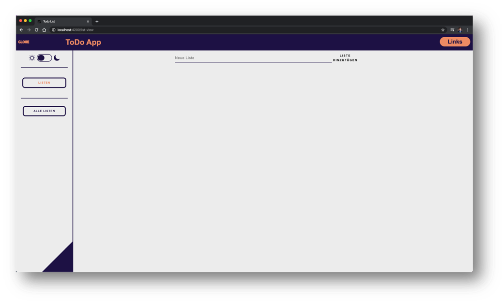

# 2nd Webdevelopment Submission

#### Table of Contents

1. [Introduction](#introduction)
2. [Angular](#setting-up-angular)
3. [Angular Project Structure](#angular-project-structure)

## Introduction

This app is created to show one possible frontend-implementation of the web api from https://shopping-lists-api.herokuapp.com/ .
It gives you the opportunity to create or delet todo lists, add, check or remove items from lists or show existing lists from other users.
Additionally there is a dark mode and a mobile version.

## Setting up Angular

Make sure you have the Angular CLI installed globally to view this project.
For detailed information how to set up Angular click [here](https://angular.io/guide/setup-local).

## Angular Project Structure

This project is created with five components. Including the main App-Component.
Additionally there are three services to make special functions available to all components.

### App Component

The App Component is the initial page which is loaded by the browser.

### Header Component

The header component is responsible for displaying the banner at the top of the screen and providing the burger-menu icons. In addition there is a link to this GitHub repository available.

### Sidebar Component

The Sidebar component gives you the ability to load pre-built lists and switch between the dashboard and individual list views.

### List-View Component

The List-View component is located on the right side of the sidebar and under the header on the page. At the beginning, all newly added lists are displayed there in a clear way. In addition, the input field which is located in the top center of the list view can be used to create or add further lists.

### List Component

The list component provides the view of a single list. These individual views are displayed on the dashboard in a grid next to each other. In the single view of a list, the corresponding component is displayed completely in the body of the page.

### List Service

The List service provides all functions related to the backend API. In addition to the API key, the URI is also stored here. For communication with the client, the Angular HTTP Client is used.

### Sidebar Service

The sidebar service is responsible for the dynamic provision of information about the selectable lists for the sidebar.

### Theme Service

The Theme-Service is responsible for providing all the required colours for the components. All colors are set as variables in the CSS files to be changeable. This functionality enables the darkmode.

### Component Routing

The component routing allows the dynamic switching and loading of individual lists. This is done by passing variable parameters in the URI. Additionally it improves the readability of the URI.

# shopping-list-client
